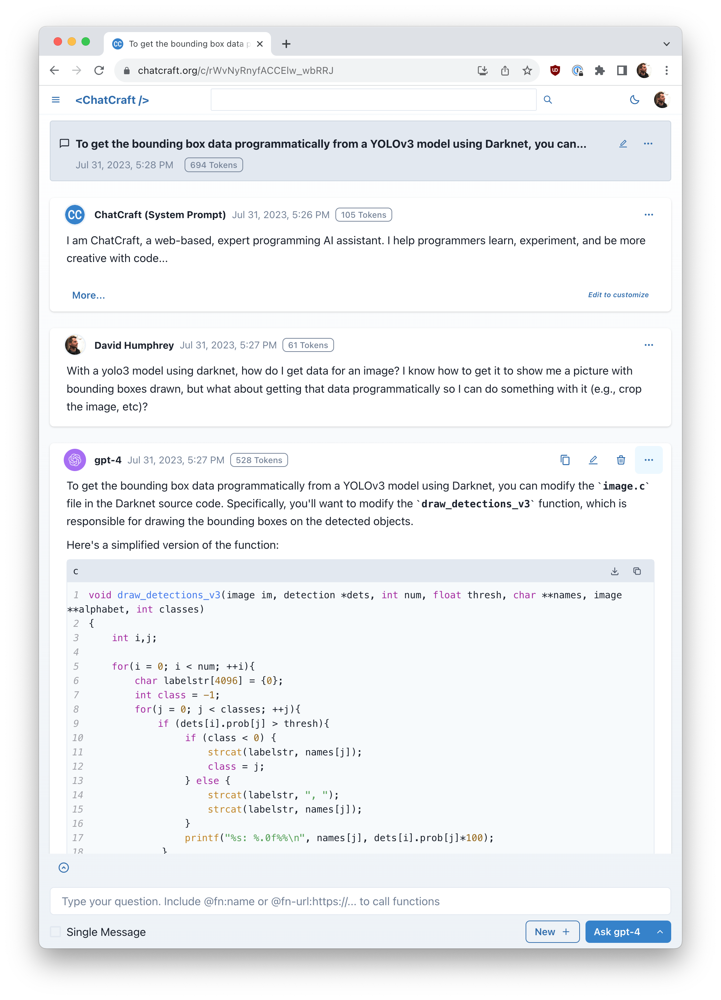

# ChatCraft.org

Welcome to [ChatCraft.org](https://chatcraft.org), your open-source web companion for coding with Large Language Models (LLMs). Designed with developers in mind, ChatCraft transforms the way you interact with GPT models, making it effortless to read, write, debug, and enhance your code.

Whether you're exploring new designs or learning about the latest technologies, ChatCraft is your go-to platform. With a user interface inspired by GitHub, and editable Markdown everywhere, you'll feel right at home from the get-go.

## Features

We think ChatCraft is the best platform for learning, experimenting, and getting creative with code. Here's a few of the reasons why we think you'll agree:

🛠️ **You're in Control**: Customize all aspects of a chat. Use your own System Prompts, edit, delete, and retry AI messages with models from competing vendors in the same chat.

🌍 **Multiple AI Providers**: ChatCraft supports both OpenAI and OpenRouter, giving you access to a variety of vendors and models. You aren't limited to ChatGPT any more!

💰 **Cost-effective**: With ChatCraft, you only pay for the calls to AI models you use, with no extra charges for the app or monthly subscription.

🌐 **Browser-based**: No installation or server required! ChatCraft works seamlessly in your browser. Also, because it's the web, ChatCraft can render lots of content automatically, from syntax-highlighted source code to [Mermaid](https://mermaid.js.org/) diagrams to HTML!

🔒 **Privacy-focused**: All chats are stored locally in a searchable database, ensuring your data stays private and secure.

💾 **Export & Backup**: Easily download, copy, and export your chat data for safekeeping or further analysis. You aren't locked into anything.

👩‍💻 **Familiar UI**: Designed with software developers in mind, ChatCraft's interface is inspired by GitHub, making it easy to navigate and use. Edit and format your chats using GitHub flavored Markdown.

🔄 **Collaborative & Shareable**: Share your chats via public URLs, duplicate chats to explore new directions, and collaborate with others.

🔧 **AI + Functions**: Write and execute custom functions, extending the power of LLM models. Functions can be written in ChatCraft itself or hosted remotely.

🎉 **Open Source & Free**: ChatCraft is an open-source project, making it free for everyone to use and contribute to.

## Getting Started

You can begin using ChatCraft today without any installation or account:

1. Got to <https://chatcraft.org/>
2. Choose an **AI provider**: [OpenAI](https://openai.com/) or [OpenRouter](https://openrouter.ai/). OpenAI supports various versions of ChatGPT (`gpt-3.5-turbo`) and GPT-4 models, while OpenRouter adds support for even more models from vendors like Anthropic, Google, and Meta. It's easy to switch providers later, or go back-and-forth.
3. Enter an **API Key**. No matter which provider you choose, ChatCraft needs an API Key to start making API calls on your behalf. API Keys are never shared, and get stored in your browser's local storage.
4. Start chatting with AI! Type your question in the textbox at the bottom of the screen and click the **Ask** button to prompt a particular model (switch to a different model whenever you like).
5. Copy, edit, delete, or retry any AI response with a different model until you get the results you need.
6. Every chat is saved to a local, offline database in your browser, which you can search (top of UI) or navigate by opening the sidebar with the hamburger menu in the top-left.

## Chat About ChatCraft

Got an idea for a new feature? Talk to us on Discord:

<https://discord.gg/JsVe9ZuZCn>

Found a bug you think we should know about? You should [file an Issue](https://github.com/tarasglek/chatcraft.org/issues)

## Why ChatCraft.org?

We've written various blog posts about our goals with ChatCraft. Here are some starting points:

- <https://blog.humphd.org/chatcraft-org/>
- <https://taras.glek.net/post/chatcraft.org-opensourcechatgpt-for-devs/>

## License

[MIT](./LICENSE)
