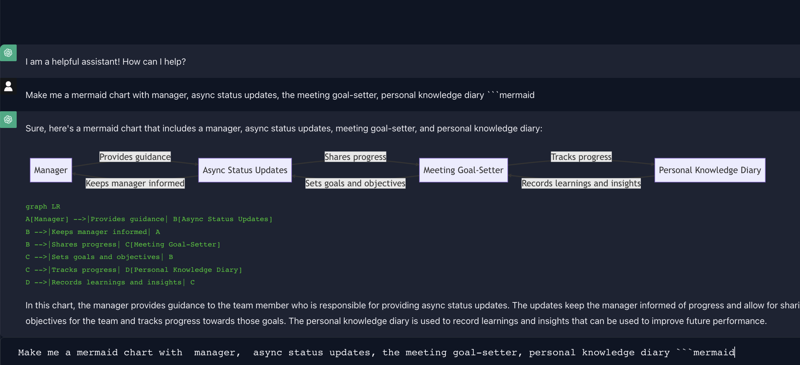

This is personal chat-gpt UI clone to facilitate Taras workflow. Hosted on https://private.overthinker.dev/

1. Supports rendering mermaid diagrams
2. Allows to delete messages for when chatbot starts barking up the wrong tree
3. Has a `Last-message-context-only mode` that's useful for `edit` workflows, also saves api cost. Switches between chatgpt and gpt-4 models
4. Is fully-clientside openai key storage, message history
5. No serverside compute dependency, pure react

